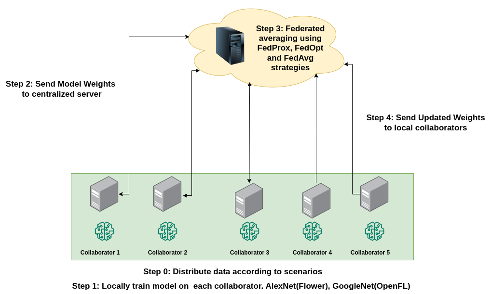
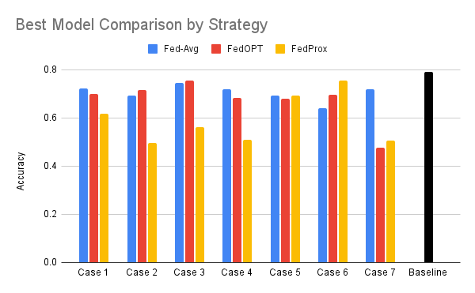
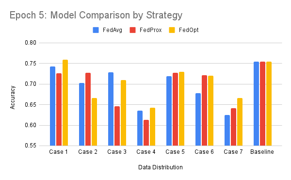

# RetinaFed: Exploring Novel Techniques for Predicting Diabetic Retinopathy through Federated Learning

### Group 15 Members: Avinash Swaminathan, Kanika Dhiman, Sagar Nandkumar Badlani, Shivam Agarwal  

## Introduction

In this project, we aim to explore different federated learning approaches to train distributed models on private healthcare data. 
We explore the federated learning setup for diabetic retinopathy area and delve deep into how particular distributions can affect the performance of our models

### Federated Learning

The proposed Federated Learning process consists of 3 steps :- 
1. <b> Local Training </b> - Each Hospital serves as a local client that trains its local models on a unique dataset it hosts. The weights of the trained model are shared with a central server.
2. <b> Global Aggregration </b> - The centralized server is connected with several clients (hospitals) and receives a locally trained model from each of them. To ensure further privacy, these weights can be encrypted while being sent over the network. The central server uses several strategies to create a globalized model from all the local models. 
3. <b> Evaluation </b> - The globalized model is evaluated on a validation/test set to determine F1 score. Further, it is sent to each of the hospitals/clients and replaces the local model. 

The globalized model can be created using several strategies. We explore FedAvg, FedProx and FedOpt strategies in our work.

## Dataset
<ul>
  <li>Dataset: Diabetic Retinopathy 224x224 Gaussian Filtered</li>
  <li>Source: Kaggle</li>
  <li>Training-Validation Split: 80%-20%</li>
  <li>Length of Dataset: 3662 samples of (224 * 224)</li>
  <li>Classes:
    <ul>
      <li>No Diabetic Retinopathy: 1805</li>
      <li>Mild: 370</li>
      <li>Moderate: 999</li>
      <li>Severe: 193</li>
      <li>Proliferative Diabetic Retinopathy: 295</li>
    </ul>
  </li>
</ul>

### Scenarios

The table illustrates the different scenarios of data distribution that we experimented on
<table>
  <tr>
    <th>Nomenclature</th>
    <th>Cases</th>
    <th>Classes per Client</th>
    <th>Length per Client</th>
  </tr>
  <tr>
    <td>Case 1</td>
    <td>Easiest Case (I.I.D)</td>
    <td>Equal (=5)</td>
    <td>Equal</td>
  </tr>
  <tr>
    <td>Case 2</td>
    <td>Easy Case</td>
    <td>Random</td>
    <td>Equal</td>
  </tr>
  <tr>
    <td>Case 3</td>
    <td>Average Case</td>
    <td>Random</td>
    <td>Random</td>
  </tr>
  <tr>
    <td>Case 4</td>
    <td>Average Case</td>
    <td>4</td>
    <td>Random</td>
  </tr>
  <tr>
    <td>Case 5</td>
    <td>Average Case</td>
    <td>3</td>
    <td>Random</td>
  </tr>
  <tr>
    <td>Case 6</td>
    <td>Hard Case</td>
    <td>2</td>
    <td>Random</td>
  </tr>
  <tr>
    <td>Case 7</td>
    <td>Hardest Case</td>
    <td>1</td>
    <td>Random</td>
  </tr>
</table>

## Methodology 

### System Architecture



### Hyperparameters
<table>
  <thead>
    <tr>
      <th></th>
      <th>OpenFL</th>
      <th>Flower</th>
    </tr>
  </thead>
  <tbody>
    <tr>
      <td>Model</td>
      <td>GoogleNet (Inception-V1) with single FC layer</td>
      <td>AlexNet with single FC layer</td>
    </tr>
    <tr>
      <td>Learning Rate</td>
      <td>0.001</td>
      <td>0.001</td>
    </tr>
    <tr>
      <td>Optimizer</td>
      <td>Adam (FedOpt, FedAvg)</td>
      <td>Adam (FedOpt, FedProx, FedAvg)</td>
    </tr>
    <tr>
      <td>Mu</td>
      <td>0.8 (FedProx)</td>
      <td>0.8 (FedProx)</td>
    </tr>
    <tr>
      <td>Number of Collaborators / Clients</td>
      <td>5</td>
      <td>5</td>
    </tr>
    <tr>
      <td>Implementation Library</td>
      <td>PyTorch</td>
      <td>PyTorch</td>
    </tr>
    <tr>
      <td>Learnable Parameters</td>
      <td>5125</td>
      <td>20485</td>
    </tr>
    <tr>
      <td>Batch Size</td>
      <td>16</td>
      <td>8</td>
    </tr>
  </tbody>
</table>

## Experiment Results

All values denote model accuracy on global validation set. 

### OpenFL

<table>
  <tr>
    <th></th>
    <th>FedAvg*</th>
    <th>FedOPT*</th>
    <th>FedProx*</th>
  </tr>
  <tr>
    <td>Case 1</td>
    <td>0.722372</td>
    <td>0.699015</td>
    <td>0.61705</td>
  </tr>
  <tr>
    <td>Case 2</td>
    <td>0.692098</td>
    <td>0.71618</td>
    <td>0.496689</td>
  </tr>
  <tr>
    <td>Case 3</td>
    <td>0.75039</td>
    <td>0.755319</td>
    <td>0.747816</td>
  </tr>
  <tr>
    <td>Case 4</td>
    <td>0.71875</td>
    <td>0.683089</td>
    <td>0.692641</td>
  </tr>
  <tr>
    <td>Case 5</td>
    <td>0.692641</td>
    <td>0.678082</td>
    <td>0.720419</td>
  </tr>
  <tr>
    <td>Case 6</td>
    <td>0.641992</td>
    <td>0.696118</td>
    <td>0.755319</td>
  </tr>
  <tr>
    <td>Case 7</td>
    <td>0.72861</td>
    <td>0.475783</td>
    <td>0.507422</td>
  </tr>
  <tr>
    <td>Baseline</td>
    <td colspan="3">0.791667</td>
  </tr>
</table>


### Flower

<table>
  <tr>
    <th></th>
    <th>FedAvg*</th>
    <th>FedOPT*</th>
    <th>FedProx*</th>
  </tr>
  <tr>
    <td>Case 1</td>
    <td>0.722372</td>
    <td>0.699015</td>
    <td>0.61705</td>
  </tr>
  <tr>
    <td>Case 2</td>
    <td>0.692098</td>
    <td>0.71618</td>
    <td>0.496689</td>
  </tr>
  <tr>
    <td>Case 3</td>
    <td>0.75039</td>
    <td>0.755319</td>
    <td>0.747816</td>
  </tr>
  <tr>
    <td>Case 4</td>
    <td>0.71875</td>
    <td>0.683089</td>
    <td>0.692641</td>
  </tr>
  <tr>
    <td>Case 5</td>
    <td>0.692641</td>
    <td>0.678082</td>
    <td>0.720419</td>
  </tr>
  <tr>
    <td>Case 6</td>
    <td>0.641992</td>
    <td>0.696118</td>
    <td>0.755319</td>
  </tr>
  <tr>
    <td>Case 7</td>
    <td>0.72861</td>
    <td>0.475783</td>
    <td>0.507422</td>
  </tr>
  <tr>
    <td>Baseline</td>
    <td colspan="3">0.791667</td>
  </tr>
</table>


## Code

### Dataset
Download dataset from Kaggle: [Link](https://www.kaggle.com/datasets/sovitrath/diabetic-retinopathy-224x224-gaussian-filtered/code) into the dataset folder.
Perform Following operations in the main directory 

```terminal
cd dataset
unzip archive.zip
cd gaussian_filtered_images/gaussian_filtered_images/
```

### OpenFL
All the OpenFL experiments can be running using <b>OpenFL-Diabetic-Demo-CustomDataDistributor<b> notebook
In order to experiment on a particular data distribution use the data_splitter function.

```python
import DataSplitterMethods
data_splitter = DataSplitterMethods.SplitFunctionGenerator("Equal-Equal-Split") #Use strings defined below to experiment on data distribution

\\ Pass this data splitter to fl_data in the train_splitter argument
fl_data = FederatedDataSet(train_data, train_labels, test_data, test_labels, 
                           batch_size = batch_size , num_classes = num_classes, 
                           train_splitter=data_splitter)
```


In the notebook, you only need to change the string in the cell for data splitter methods and run the entire notebook

<table>
  <tr>
    <td>Scenario</td>
    <td> String </td>
  </tr>
  <tr>
    <td>Case 1</td>
    <td>Equal-Equal-Split</td>
  </tr>
  <tr>
    <td>Case 2</td>
    <td>Random-Equal-Split</td>
  </tr>
  <tr>
    <td>Case 3</td>
    <td>Random-Unequal-Split</td>
  </tr>
  <tr>
    <td>Case 4</td>
    <td>4-Class-per-collab-split</td>
  </tr>
  <tr>
    <td>Case 5</td>
    <td>3-Class-per-collab-split</td>
  </tr>
  <tr>
    <td>Case 6</td>
    <td>2-Class-per-collab-split</td>
  </tr>
  <tr>
    <td>Case 7</td>
    <td>1-Class-per-collab-split</td>
  </tr>
</table>
